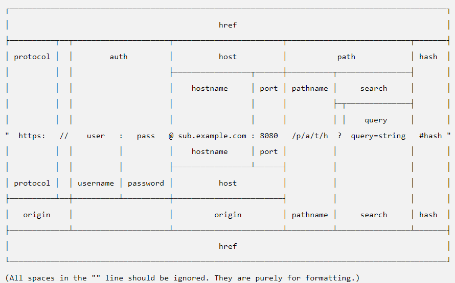

# HTTP

Es el protocolo (idioma) en el que hablan el navegador con los servidores dentro del mundo web.

Sus siglas hacen referencia a HyperText Transfer Protocol.

Tiene una versión (otro protocolo) segura HTTPS.

El protocolo especifica la forma e hacer las solicitudes (Request) a un servidor y como se deben rebicir las respuestas.

## Request

Hace referencia a la solicitud de información. Esto sería el primer paso de una comunicación HTTP, el envío de una request por parte de un cliente.

El `fecth` dentro del navegador (cliente) es el que realiza la request y recibe la respuesta.

Para hacer una request necesito los siguientes elementos:

- URL
- Método HTTP
- Cabeceras de Request
- Cuerpo de solicitud

### URL

Es la dirección del recurso que el cliente esta solicitando. Tiene las siguientes partes:

- **Protocolo**: Es el idioma con el que voy a hablar con el servidor. En HTTP pueden ser dos `http` o `https`, en función de si quiero la información de la request cifrada o no.
- **auth**: indico al servidor con que usuario quiero conectarme, utilizando la autentación basic (ya con muy poco uso)
- **host (Hostname + Puerto)**: Es la dirección del servidor en internet (o en la red).Tendremos que poner en el hostname una ip o un dns y en el puerto el número donde se encuentra ese servidor en ese ordenador. Por defecto el puerto de HTTP es el `80` y el de HTTPS es el `443`. El navegador, como es muy listo, mete el puerto por debajo, sin que el usuario tenga que hacerlo.
- **path**: Es la ruta donde se encuentra la información que quiero en el servidor. Cada nivel se separa por un `/`.
- **queryString**: Son parametros de la URL a la request. El servidor puede leerlos y así propocionar diferentes respuestas en función de ese parámetro. Son pares `clave=valor` separados por un caracter `&`. Todo el query string empieza por el caracter `?`
  Ejemplo: `?param1=valor1&param2=valor2`
- **Hash**: Indica al navegador, la sección de la página a la que se tiene que dirigir. Para escribir un hash, despues del query string, tenemos que poner el caracter `#` con el id de la seccion que queremos cargar.

### Método HTTP

Es indicarle al servidor que operación quieres hacer con el recurso (pro ejemplo el CRUD)

- **GET**: Es el método utilizado para recibir la información de un recurso. Cuando pongo una URL en el navegador lo que hace es un GET al servidor. Sería la R del CRUD.

- **POST**: Es el método utilizado para crear un nuevo recurso

- **PUT**: Es el método utilizado para actualizar un recurso

- **DELETE**: Es el método utilizado para borrar un recurso

### Cabeceras

Sirven para poder enviar información, que no tiene que ver con el recurso en concreto (ya que esto sería el queryString), al servidor.

Por ejemplo en las cabeceras enviamos:

- Autenticación (Quien soy como usuario)
- User-Agent (Que navegador soy)
- Accept (que formato de respuesta acepto)
- Accept-Language (que idioma navega mi usuario)
- Cookies
- ...

Las cabeceras son pares `clave:valor`, donde la clave es el nombre de la cabecera y el valor la información que queremos proporcionar.

### Cuerpo de la solicitud (body)

Es la información que quiero mandar sobre el recurso. Principalemente se usa en dos metodos HTTP de los que hemos dado (el POST y el PUT)

El formato es libre, pero habitualmente se usa JSON.

## Response

Es lo que el servidor nos responde. Principalmente tiene 3 elementos:

- Codigo de respuesta HTTP
- Cuerpo de la respuesta
- Cabeceras de respuesta (Son lo mismo que las de request)

### Codigo de respuesta

Cuando hacemos una solicitud HTTP, el servidor nos responde con un código de respuesta. Es un número que va desde el 100, hasta el 600 aproximadamente. Esto se podría ampliar proximamente.

Esos números está categorizados por rangos:

- **100-199**: Respuesta informativa.
- **200-299**: Solicitud ha ido OK y tienes una respuesta correcta
- **300-399**: Solicitud has sido redireccionada a otra URL.
- **400-499**: Error en la información request (Error de usuario).
- **500-599**: Errores internos del servidor.

[Referencia códigos HTTP](https://es.wikipedia.org/wiki/Anexo:C%C3%B3digos_de_estado_HTTP)

### Cuerpo de la respuesta

Es donde va al información de la solicitud, lo que iría en el segundo then del fetch, es decir, los datos.

Pueden venir en muchos formatos, habitualmente nosotros en JS utilizamos JSON.
