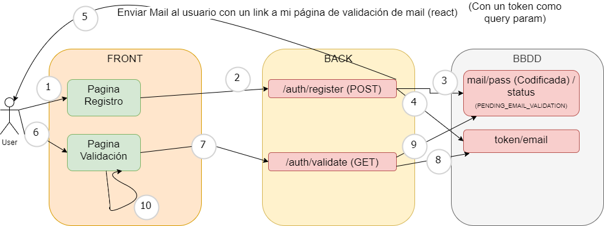

# Register / Login Flow example

Esto es un ejemplo del flujo de registro/login en una aplicación.

## Flujo imagen

## Pasos

1. Crear una página en react con un formulario de al menos 3 campos (email, pass, repeat_pass) [File](./auth-front/src/pages/register/index.jsx)
2. En el submit del formulario validar que la pass y el repeat_pass son igual [File linea 9](./auth-front/src/pages/register/index.jsx)
3. Llamar con fetch a vuestro API de registro con el email y el pass [File linea 24](./auth-front/src/pages/register/index.jsx)
4. Crear un API de registro (POST /auth/register) [File linea 14](./auth-back/src/auth/auth.router.js)
5. En el controller habrá que hacer: [File linea 45](./auth-back/src/auth/auth.controller.js)
    - Intentar recuperar el usuario con el email que nos han metido en el body
    - Si el usuario existe, devolver un 409 (conflict) indicando al cliente que el usuario ya existe
    - Si no existe tenemos que:
        - codificar la password
        - crear el usuario (documento) en BBDD con el mail, encodePass y status (EMAIL_VARIFICATION)
        - generar un token aleatorio de 128 caracteres
        - crear un documento (en la entidad email_verification) que tenga token e email.
        - enviar email con la URL del front que tenga el token como query param
        - devolver un 201 (created)
6. Crear una página en react para la validación. [File](./auth-front/src/pages/validate-email/index.jsx)
7. En la página de react lo primero que hacemos es recuperar el token y llamar con fecth a nuestro API de /auth/validate (GET), pasándole el token por query param. [File linea 16](./auth-front/src/pages/validate-email/index.jsx)
8. Si el API me da un 400, mostrar error al usuario
9. Si me da 200, muestro validación ok e informo al usuario de email validado/ completar el registro
10. Crear un endpoint en mi API GET /auth/validate [File linea 17](./auth-back/src/auth/auth.router.js)
11. El controller de este endpoint tiene que: [File linea 74](./auth-back/src/auth/auth.controller.js)
    - recuperar el token del query param
    - recuperar el mail asociado a ese token
        - si existe
            - borrar el documento del token de la collection
            - actualizar el usuario cambiandole el status a SUCCESS
        - si no existe, devuelvo un 400 al usuario.

12. En el login hay que modificar lo siguiente: [File linea 19](./auth-back/src/auth/auth.controller.js)
    - el controller codifica la password
    - La busqueda en la BBDD en vez de ser por email es por email y encodedPass y status SUCCESS.